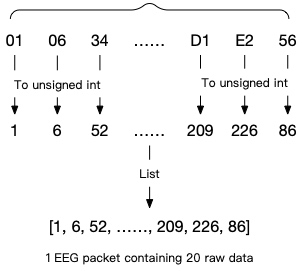
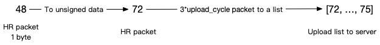

# Bio-data analysis service protocols
Analysis service for bio-data (EEG, HR, etc.).Other services for affective computing depend on the bio-data analysis service. You need to initialize and upload the bio-data before you can request the affective computing service.

Service|Operation|Remarks
---|---|---
bio-data|init|Start and initialize the analysis service of bio-data
  |subscribe|Subscribe to real-time bio-data
  |unsubscribe|Unsubscribe from real-time biological data
  |upload|Upload data
  |report|Get current bio-data report


## bio-data init
Start and initialize the bio-data analysis service.

### init Request struct
```Python
{
    "services": "bio-data",
    "op": "init",
    "kwargs": {
        "bio_data_type": [ 
            bio_data_type1, # The type of bio-data analysis service to be initialized, eeg, hr
            bio_data_typeN
        ],
        "algorithm_params": { # Optional parameters
            bio_data_type1: { # The type of bio-data (see the algorithm initialization parameter list for details)
                "filter_mode": filter_mode, # filter_mode: "smart", "basic" or "hard"
                "power_mode": power_mode, # power_mode: "rate" or "db"
            }
        },
    }
}
```

***Request Example***

```Python
{
    "services": "bio-data",
    "op": "init",
    "kwargs": {
        "bio_data_type": [ 
            "eeg", "hr"
        ],
        "algorithm_params": {
            "eeg": {
                "filter_mode": "smart",
                "power_mode": "rate",
            }
        },
    }
}
```

**Initialization parameter table**


|parameter|value|secondary parameter|secondary parameter value|description|comment|
|---|---|---|---|---|---|
| bio_data_type | eeg | | | brainwave_data
|| hr | | | heart_rate_data
| algorithm_params | eeg | filter_mode | smart | Smart filtering, automatically identify and filter possible noise, reduce the impact of noise. Suitable for most applications | default
||| | basic | Basic filtering, only basic drift removal and bandpass filtering, contains more information and noise. Suitable for people who need to do their own research on the signal
||| | hard | hard threshold filtering, between basic filtering and intelligent filtering, with hard threshold de-noising of the waveform to reduce the effect of noise to a certain extent.|flowtime is now using this mode
| | eeg | power_mode | rate | Outputs the energy ratio of EEG rhythms, focusing on the relationship between different brain waves | default
| | | | db | Outputs the decibel value of EEG rhythm energy, focusing on the trend of single brain wave.|flowtime is now using this mode


### init Response structure

```Python
{
    "code": 0,
    "request": {
        "services": "bio-data",
        "op": "init"
    },
    "data": {
        "bio_data_type": [
            bio_data_type1, # The type of bio data analysis service that has been initialized
            bio_data_typeN
        ]
    }
}
```

## bio-data Subscribe

Subscribe to real-time data from the bio-data Analytics service. The analysis return value is an optional service. If you need to receive the value returned by the analysis in real time, enable this subscription and configure the parameters to be returned. See the table below for the specific parameters.

- Note: Subscribe has two types of Responses
    - Subscribe Status Response
    - Subscribe Data Response

### Real-time bio-data analysis return value

| bio-Data Category | Field | Type | Value Range | Description | Remarks |
| :---: | :---: | :---: | :---: | :---: | :---: |
| eeg | eegl_wave | list[float] | [-500, 500] \* 150 \* upload_cycle (x<=6) | Left channel EEG waveform fragment, initial stage returns empty array, then returns array length of 150 \* upload_cycle | upload_cycle exceeds 6 at maximum of 1000
|| eegr_wave | list[float] | [-500, 500] \* 150 \* upload_cycle (x<=6) | Right channel EEG waveform fragment, initial stage returns empty array, then returns array length of 150 \* upload_cycle | upload_cycle exceeds 6 at maximum of 1000
|| eeg_alpha_power<br>eeg_beta_power<br>eeg_theta_power<br>eeg_delta_power<br>eeg_gamma_power | float | [0, 1] | EEG alpha/beta/theta/δ/gamma band energy share/decibel value, returns 0 for initial phase and poor signal quality, returns energy share/decibel value for all other cases | |
|| eeg_quality | int | {0, 1, 2, 3, 4} | EEG signal quality level 0 means no wear detected, poor contact between electrode and skin 1 means data detected but no valid EEG signal 2 means EEG signal detected but low signal-to-noise ratio, only waveform is displayed and no calculation is performed 3 means EEG signal detected is of normal quality, normal calculation can be performed 4 means EEG signal detected is of good quality, high signal-to-noise ratio, more accurate calculation result
| hr | hr | int | [0, 255] | heart rate value |
|| hrv | float | [0, 255] \* 3 \* upload_cycle | Heart rate variability, return array length is 3 \* upload_cycle |


### Subscribe Request structure

```Python
{
    "services": "bio-data",
    "op": "subscribe",
    "args": [bio-data_type1, bio-data_type2] # bio-data types, eeg, hr, etc
}
```

***Request Example***
```Python
{
    "services": "bio-data",
    "op": "subscribe",
    "args": ['eeg', 'hr']
}
```

### Subscribe Response structure
**Subscribe Status Response** 


```Python
{
    "code": 0,
    "request": {
        "services": "bio-data",
        "op": "subscribe"
    },
    "data": {
        "sub_" + bio_data_type1 + "_fields": [ # bio_data_type1: bio-data type, eeg, hr, etc
            data_type1, data_typeN # See Real-Time bio-data Analysis Return Value Table Parameters Column
        ],
        "sub_" + bio_data_typeN + "_fields": [
            data_type1, data_typeN,
        ]
    }
}
```

**Subscribe data Response** 

The data returned depends on the data set during Subscribe.

```Python
{
    "code": 0,
    "request": {
        "services": "bio-data",
        "op": "subscribe"
    },
    "data": {
        bio_data_type1: { # bio-data types, eeg, hr, etc.
            data_type1: data1, # See Real-time bio-data analysis return value table for details
            data_typeN: dataN,
        },
        bio_data_typeN: {
            data_type1: data1,
            data_typeN: dataN,
        }
    }
}
```

## bio-data Unsubscribe
Unsubscribe from the bio-data Analysis Service real-time data.

### Unsubscribe Request structure

```Python
{
    "services": "bio-data",
    "op": "unsubscribe",
    "args": [bio-data_type1, bio-data_type2]
}
```

***Request Example***
```Python
{
    "services": "bio-data",
    "op": "unsubscribe",
    "args": ["eeg"]
}
```

### Unsubscribe Response structure

```Python
{
    "code": 0,
    "request": {
        "services": "bio-data",
        "op": "unsubscribe"
    },
    "data": {
        "sub_" + bio_data_type1 + "_fields": [ # bio_data_type1: the type of bio-data being subscribed to, eeg, hr, etc
            data_type1, data_typeN
        ],
        "sub_" + bio_data_typeN + "_fields": [
            data_type1, data_typeN,
        ]
    }
}
```
## bio-data Upload
Client uploads bio-data. The client takes multiple packets received from the hardware and combines them into one and uploads them. For example, EEG data is received from the hardware as 30 packets and then uploaded as 1 packet, while heart rate is received as 1 packet for every 2 packets and then uploaded. See the following description for details.

### Upload Request structure

```Python
{
    "services": "bio-data",
    "op": "upload",
    "kwargs": {
        bio_data_type1: data, # bio_data_type1 bio-data type, e.g. eeg, hr, etc.; data: Stitched bio-data packet (data=[126, 45, 24, 67 ... 34, 154, 200, 123, 875]; len(data) == 600), see client-side bio-data processing for details.
        bio_data_typeN: dataN
    }
}
```

***Request Example***
```Python
{
    "services": "bio-data",
    "op": "upload",
    "kwargs": {
        "eeg": [126, 45, 24, 67 ... 34, 154, 200, 123, 875]
    }
}
```

### Handling of client-side bio-data
bio_data_type | description | number of stitched packets per client upload | packet reception interval from hardware (sec) | client upload theoretical interval (sec) 
:---: | :---: | :---: | :---: | :---:
eeg | Dual-channel EEG data | 50 * upload_cycle | 0.012 | 0.6 * upload_cycle
hr | Heart rate data | 3 * upload_cycle | 0.2 | 0.6 * upload_cycle

#### The structure of EEG data packet received from device
| Packet serial number  | First data  | Second data  | Third data  | Fourth data  | Fifth data  | Sixth data  |
|---|---|---|---|---|---|---|
| 2 bytes  | 3 bytes  | 3 bytes  | 3 bytes  | 3 bytes  |  3 bytes | 3 bytes  |
| 0x0D,0x08  | 0x00,0x01,0x02  | 0x03,0x04,0x05  | 0x00,0x01,0x02 | 0x00,0x01,0x02  | 0x00,0x01,0x02  | 0x00,0x01,0x02  |

The EEG data packet will transmit 6 EEG data of 2 EEG channels at a time, each data is 24-bit quantized.

As in the above table, the first data is 0x000102, which belongs to the left channel EEG data; the second data is 0x030405, which belongs to the right channel EEG data. And so on, the 1st, 3rd and 5th data are left channel EEG data, the 2nd, 4th and 6th data are right channel EEG data.

> [!NOTE]
> You don't need to know the packet structure to use the affective cloud platform, you just need to stitch the packets together and upload them(details in next section). You only need to understand the package structure if you want to get EEG data directly from the device.

#### Dual-channel EEG data processing

Convert the bytes in the EEG packet to unsigned integers in decimal order. The converted data is stored as a list, which contains 20 data after the conversion is completed.




Stitch 20 EEG packets, i.e. 600 data, into a list, and then upload this list to the affective cloud server via the affective cloud EEG interface.

#### Heart rate and wear detection data processing



* Converts the heart rate/wear detection data to an unsigned integer in the decimal system.
* Save the 2 heart rate/wear detection data as a list and then upload it to the affective cloud server via the affective heart rate/wear detection interface.


## bio-data Report
After the number of packets returned by the subscription service has reached the required number, you can request a service data report. The report returns an analysis of all values from the start of the service to the execution of the operation. The specific report results that can be returned are shown in the following table.

### Report call interval

> [!NOTE]
> * The report can be requested only after the number of packets returned by the subscription service has reached the required number, otherwise the return value is null or 0.
> * Each requested Report is cached for 2 minutes, and the Report requested within 2 minutes is the result of the previous analysis. 2 minutes later, the cache expires, we will clear the Report data in the cache, and the new full Report data report is returned when requested again.
> * Test application report retention time is 1 minute.

| Category | Number of packets to be received | Request interval |
| :---: | :---: | :---: | 
| eeg | 20 | 2min |
| hr | 20 | 2min |

| Category | Parameters | Type | Value Range | Description |
| :---: | :---: | :---: | :---: | :---: |
| eeg | eeg_alpha_curve<br>eeg_beta_curve<br>eeg_theta_curve<br>eeg_delta_curve<br>eeg_gamma_curve | list[float] | [0, 1]*k, (k≥5) | EEG alpha/beta/theta/δ/gamma frequency band energy change curves with 0.6x second intervals between horizontal coordinate points |
| hr | hr_avg | float | [0, 255] | Heart rate average |
|| hr_max | float | [0, 255] | Heart rate maximum |
|| hr_min | float | [0, 255] | heart rate min |
|| hr_rec | list[int] | [0, 255]*k, (k≥5) | Heart rate values are recorded throughout, with an interval of 0.6x seconds between horizontal coordinate points |
|| hrv_avg | float | [0, 255] | Heart rate variability mean |
|| hrv_rec | list[float] | [0, 255]*k, (k≥5) | Heart rate variability is recorded in full, with an interval of 0.2 seconds between points |

### Report Request structure

```Python
{
    "services": "bio-data",
    "op": "report",
    "kwargs": {
        "bio_data_type": [
            bio_data_type1, # Bio data type, eeg, hr, etc.
            bio_data_typeN
        ]
    }
}
```

***Request Example***
```Python
{
    "services": "bio-data",
    "op": "report",
    "kwargs": {
        "bio_data_type": [
            "eeg"
        ]
    }
}
```

### Report Response structure

```Python
{
    "code": 0,
    "request": {
        "services": "bio-data",
        "op": "report"
    },
    "data": {
        bio_data_type1: { # Bio data type, eeg, hr, etc
            data_type1: data1, # See also bio_data_analysis_statistics_report Parameters column, data: See also bio_data_analysis_statistics_report Type, range of values, etc.
            data_typeN: dataN,
        },
        bio_data_typeN: {
            data_type1: data1,
            data_typeN: dataN,
        }
    }
}
```
