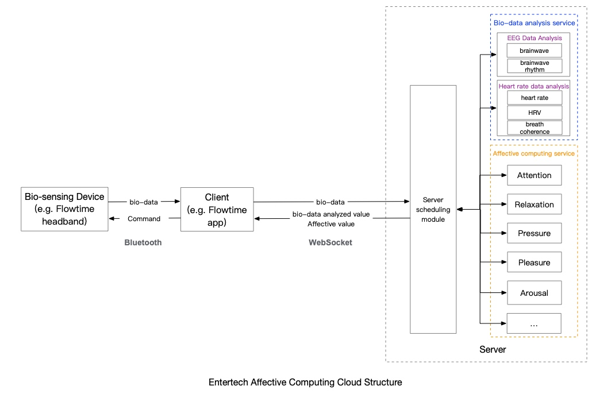

## Entertech Affective Cloud Introduction

## Architecture Introduction

Entertech affective cloud computing platform can provide real-time feedback on affection through a comprehensive analysis of multi-dimensional bio-data (including EEG, heart rate, etc.).

Hosts (e.g. VR devices, cell phones, PCs, etc.) connect to the bio-sensing device(e.g., Flowtime headband) via Bluetooth to control its monitoring of bio-data. Integrate our affective cloud computing interface in the app, send the bio-data to the cloud, and the cloud will return the app's analyzed affective computing value through algorithm analysis.

At present, the Affective Cloud has already achieved the analysis of attention, relaxation value, pressure level, pleasure level, and other related computing, and more affective computing capabilities will be developed one after another.

## Glossary

* [Brainwave （EEG）](https://www.notion.so/Brainwave-EEG-b3a44e9eb01549c29da1d8b2cc7bc08d)
* [Brainwave Rhythms](https://www.notion.so/Brainwave-Rhythms-4cdadda14a69424790c2d7913ad775ff)
* [Heart Rate](https://www.notion.so/Heart-Rate-4d64215ac50f4520af7ff516c0f0e00b)
* [HRV](https://www.notion.so/HRV-80f6c62658f948cabca943d0e11ee429)
* [Attention](https://www.notion.so/Attention-84fef81572a848efbf87075ab67f4cfe)
* [Relaxation](https://www.notion.so/Relaxation-c9e3b39634a14d2fa47eaed1d55d872b)
* [Pressure](https://www.notion.so/Pressure-ee57f4590373442b9107b7ce665e1253)
* [Breath Coherence](https://www.notion.so/Breath-Coherence-783f1d77aa1148e5a8ddcfc9454dd008)

# Bio-sensing device(Flowtime Headband)

For documents on operating Flowtime:

* [How to connect Flowtime headband with the app?](https://www.notion.so/How-to-connect-Flowtime-headband-with-the-app-a0808b2d99b74e65b9bcd6e85f5f6c97)
* [I can't connect the headband with the app.](https://www.notion.so/I-can-t-connect-the-headband-with-the-app-1ae10dc7fe1049c4953fc879f9042730)

Look for more help in our [Flowtime Help Center](https://www.notion.so/Flowtime-Help-Center-b151d8677e5c41d8af6364f44fb93369).

## Platform capabilities

We now offer the bio-data analysis service and the affective computing service. The bio-data analysis service includes analysis of brainwaves and heart rate, providing values such as brainwave rhythm and HRV. The affective computing service provides values including attention, relaxation, etc.

Both services offer both real-time calculations and data report after a period of use.

See [Platform capabilities](/Platform capabilities.html) for details.

## Development Resources

### Development resources for iOS and Android Platform

If your platform happens to be iOS or Android, you can also use our already developed Bluetooth SDK for quick integration. demos are already developed and available for testing in the SDK. Also, you can develop Bluetooth services on devices that have Bluetooth connectivity through our standard Bluetooth development documentation.

See [Development resources for iOS and Android Platform](Development resources for iOS and Android Platform.md.html) for details.

### Affective cloud protocol

The SDK we provide for iOS/Android has integrated the WebSocket operation for connecting with our server. But if you need to develop another platform client or just want to know the details of affective cloud computing protocol, you can see [Affective Cloud Protocol](Affective Cloud Protocol/1. Summary.html).
