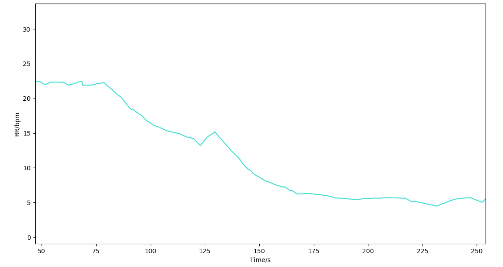

# 呼吸（Breath）

## 名词解释

### 呼吸率（RR）

呼吸率也成为呼吸频率，指单位时间内呼吸的次数，通常以1分钟的呼吸次数来表示（单位为次/分），正常成年人在静息状态下自然呼吸频率一般在12-20 次/分[^1]。

回车生物信号采集模块通过压电薄膜传感器（PVDF）测量并分析与呼吸相关的信号成分，从而计算呼吸率。

### 呼吸波（RW）

呼吸波是随呼吸而形成的周期性波形，可以反映实时的呼吸情况。

回车生物信号采集模块通过压电薄膜传感器（PVDF）测量并分析与呼吸相关的信号成分，得到有效的呼吸波波形。

:::info
由于呼吸的周期较长，相关信号分析所需的窗口时间较长，因此呼吸率与呼吸波的实时输出理论上存在一定程度的滞后性。
:::

## 最佳实践

:::tip
通过「最佳实践」，我们会提供一些我们已经实践过的应用场景供你参考，通过这些例子你可以了解如何将我们提供的数据和你的应用场景结合。
:::

### 呼吸率在冥想应用场景下的实践

呼吸率可以反映冥想过程中的呼吸情况。自然呼吸的状态下呼吸率较高，一般为 12-20 次/分，而在冥想过程中，尤其是有规律的深呼吸状态下，可以看到呼吸率明显降低。当呼吸率为 6 次/分时，可达到和谐状态（相关说明见[和谐度介绍](./和谐度（Coherence）)）。

---

**参考文献**

[^1]: Chourpiliadis C. (2020). Physiology, Respiratory Rate In: StatPearls.  https://www.ncbi.nlm.nih.gov/books/NBK537306/
