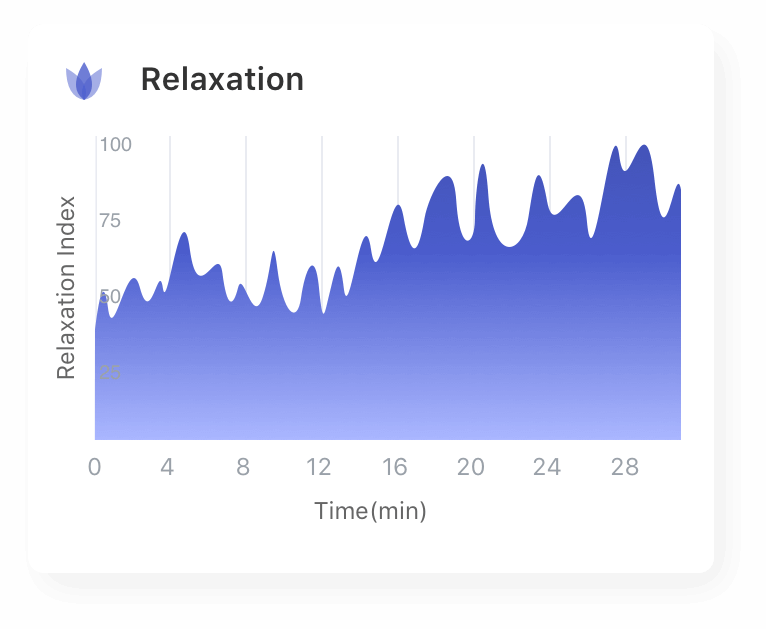
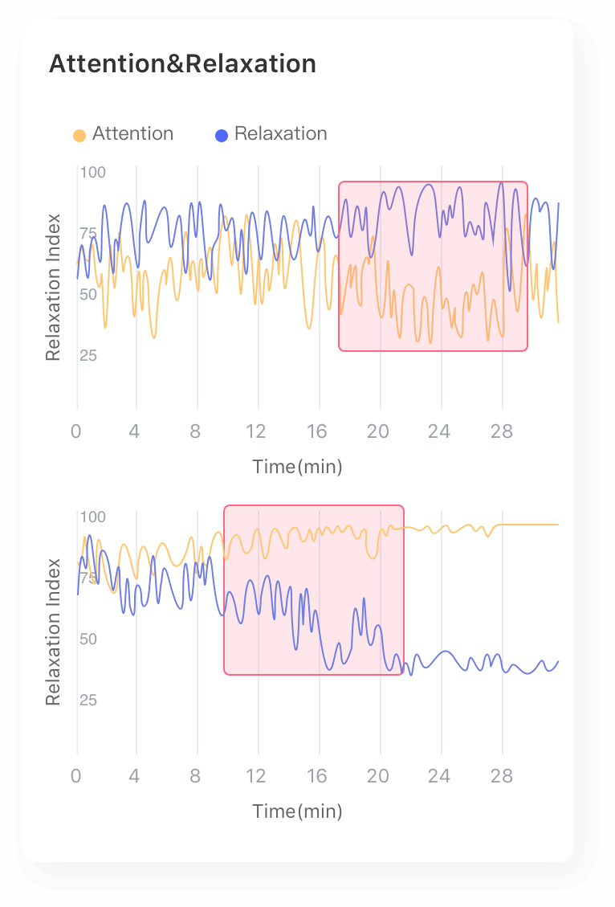
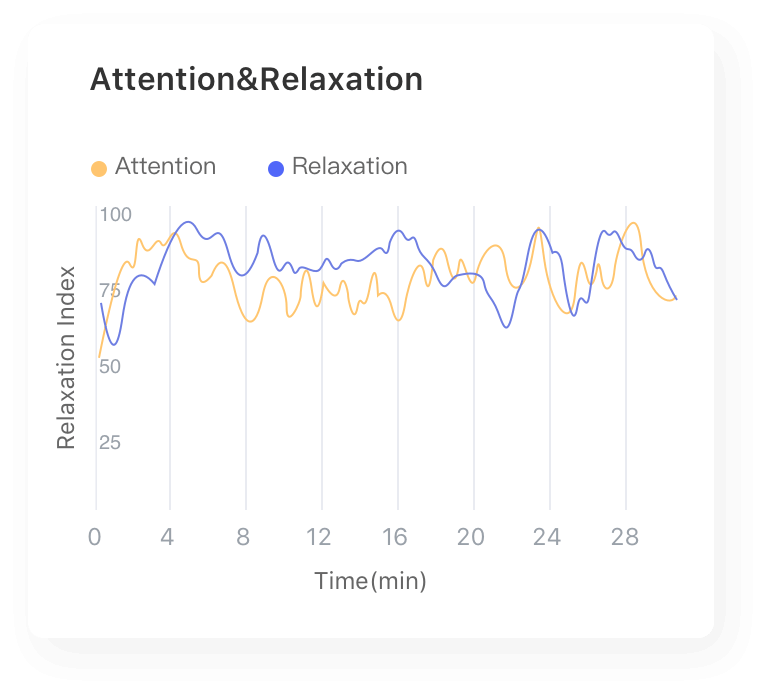

# 放松度（Relaxation）

## 名词解释

在清醒放松状态下，脑电波具有独特的特征[^1][^2]，研究表明α波能量的增加与放松存在联系[^3][^4]。

放松度监测算法基于大量数据建模，并通过实时分析脑电波的频谱特征从而计算放松度，用于评价大脑的放松程度。放松度主要反映精神层面的放松状态（即无任务清醒静息状态），较高的放松度表明大脑清醒放松，而较低的放松度则表明可能处于紧张或焦虑的状态。

通过放空、深呼吸、闭眼放松等方式可以提高放松度的值。

:::info
由于每个人的脑电节律存在差异，放松度监测算法会在体验的初始阶段采集基线来进行自适应。为了获得较好的体验，在体验开始的前30秒请尽量减少面部活动（如眨眼、眼动、咬牙等）带来的干扰。
:::

## 最佳实践

:::tip
通过「最佳实践」，我们会提供一些我们已经实践过的应用场景供你参考，通过这些例子你可以了解如何将我们提供的数据和你的应用场景结合。
:::

### 放松度在冥想场景下的应用

大多数形式的冥想都是大脑放松的过程。通过放松度指标可以反映冥想过程中的放松度变化趋势，一般在闭眼放松或进入冥想状态后，放松度会提高，经过放松训练可以提高放松度水平，使精神得到更快的恢复。

**注意力与放松度（Attention & Relaxation）**

注意力监测模块与放松度监测模块结合能够更好地反映冥想的状态。

对于未经过长期冥想训练的人，特定状态下的脑电波频谱较为集中，在专注状态下放松度一般不高，而在放松状态下注意力一般较低，两者呈现出“互斥”的现象；而经过长期冥想训练的人，脑电波频谱分布更广阔而均匀，可以在大脑清醒放松的同时保持专注和觉醒的状态，在冥想过程中注意力和放松度均能维持在较高水平。这种状态下，由于大脑放松而专注，更容易迸发灵感，创造力较强。

---

**参考文献**

[^1]: Jalaudin, Nurasma & Amin, Muhammad. (2019). EEG analysis on human reflection towards relaxation of mind. Malaysian Journal of Fundamental and Applied Sciences. 15. 185-189. 10.11113/mjfas.v15n2.1103.
[^2]: Mohd Aris, Siti Armiza & A. Jalil, Siti Zura & Bani, Nurul & Mad Kaidi, Hazilah & Muhtazaruddin, Mohd. (2018). Statistical Feature Analysis of EEG Alpha Asymmetry Between Relaxed and Non-Relaxed. 171-175. 10.1109/ICBAPS.2018.8527396.
[^3]: Phneah, Swee & Nisar, Humaira. (2017). EEG-based alpha neurofeedback training for mood enhancement. Australasian Physical & Engineering Sciences in Medicine. 40. 10.1007/s13246-017-0538-2.
[^4]: Chen, Andrew & Feng, Weijia & Zhao, Huixuan & 🌚, Yanling & Wang, Peipei. (2008). EEG default mode network in the human brain: Spectral regional field powers. NeuroImage. 41. 561-74. 10.1016/j.neuroimage.2007.12.064.
