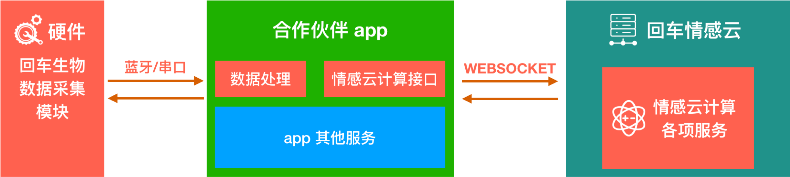

# 回车情感云计算介绍

## 架构简介

回车情感云计算平台可以通过多维生理数据（包括脑电、心率等）的综合分析，实时反馈生理、情感状态。

主机（如 VR 设备、手机、PC 等）通过蓝牙、板载串口（深度合作，板载集成）等方式来连接回车的混合脑机接口模块，控制其采集生物电信号。在 app 中集成我们的情感云计算接口，将采集到的生物电信号数据发送到云端，云端通过算法分析后返回 app 分析后的情感计算值。

现回车情感云计算已实现注意力、放松度值、压力水平、愉悦度等相关计算，后续将会陆续开发更多情感计算的能力。

## 硬件模块接入

### 蓝牙

将回车混合脑机接口模块作为外设，通过蓝牙和主机连接，实现快速接入。

#### 蓝牙模块操作文档

蓝牙硬件模块的相关操作文档，见左侧导航栏中的蓝牙混合脑机接口模块。

* [操作说明](./📲蓝牙混合脑机接口模块/回车生物电蓝牙混合脑机接口模块操作说明.html)
* [注意事项](./📲蓝牙混合脑机接口模块/回车蓝牙混合脑机接口模块使用注意事项.html)

#### 蓝牙开发和蓝牙 SDK

你可以通过我们的标准蓝牙开发文档，在有蓝牙连接功能的设备上开发蓝牙服务。如果你的平台刚好是 iOS 或者 Android ，也可以使用我们已经开发好的蓝牙 SDK 实现快速的接入。SDK 中已经有开发好可供测试的 demo。

* [回车蓝牙混合脑机接口模块通信协议](https://entertech.feishu.cn/docs/doccnlmMLpxwY25gJQyiFQmBeRd)
* [回车蓝牙混合脑机接口模块开发资源](./开发资源.html)

### 板载串口

省去供电、蓝牙等模块，直接板载集成，深度合作。

1. 通过控制指令控制硬件模块功能的启停；
2. 硬件模块根据控制指令，采集数据并回传给 app；
3. App 接收到数据包，按照脑电、心率、佩戴监测等不同数据包进行转换、拼接，打包成可上传的数据包；
4. 将处理后的脑电、心率、佩戴检测数据包通过各自的数据接口上传到情感云。

板载方案需要合作定制，相关通信协议合作确定后提供。

## 情感云计算服务端接口

情感云服务端接口提供包括脑电波、心率等基础的生物数据分析能力和注意力、情绪愉悦度等高级情感分析能力。具体的能力介绍参见[平台能力](./平台能力.html)章节。

