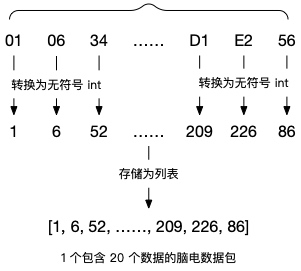
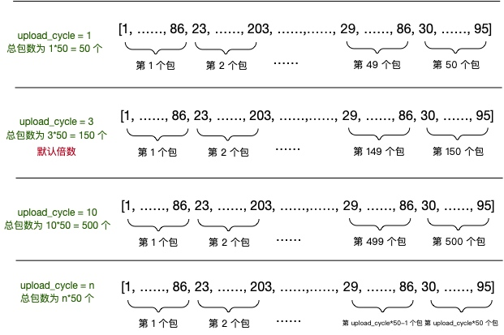

# 生物数据基础分析服务协议
生物数据（EEG、HR等）的基础分析服务。此部分数据为情感计算服务的数据基础。需要先初始化并上传生物数据，才能进行情感计算服务。

服务|操作|备注
---|---|---
biodata|init|启动、初始化生物数据基础分析服务
 |subscribe|订阅实时生物数据
 |unsubscribe|取消订阅实时生物数据
 |upload|上传数据
 |report|获取当前生物数据报表


## Biodata init
启动、初始化生物数据基础分析服务。

### init Request 结构体

> [!NOTE]
> * **脑电检测容差等级**，从原始数据中提取脑电信号时对信号质量的容许程度。
* 该值越大，对佩戴情况的要求越低，在受到干扰时输出数据的概率较高，但其中包含噪声的概率也较高；
* 该值越小，对佩戴情况的要求越高，在受到干扰时可能无法输出数据，但输出的数据中包含噪声的概率较小；
* 参数 tolerance 为可选参数，目前仅适用于 EEG，取值范围为 0~4，默认值为 2。

---

> [!NOTE]
> * **双通道脑波能量**，从原始数据中计算出的除了基础数据（eegl_wave，eegr_wave，eeg_alpha_power，eeg_beta_power，eeg_theta_power，eeg_delta_power，eeg_gamma_power）之外的数据。
* 参数 channel_power_verbose 为可选参数，目前仅适用于 EEG，详细返回参数可参考**实时生物数据分析返回值表**。

```Python
{
    "services": "biodata",
    "op": "init",
    "kwargs": {
        "bio_data_type": [ 
            bio_data_type1,  # 需要初始化的生物数据分析服务类型，eeg、hr
            bio_data_typeN
        ],
        "algorithm_params": {  # 可选参数
            bio_data_type1: {  # 生物数据类型
                "tolerance": tolerance,  # 目前只支持eeg；value: 0--4，默认2（兼容旧协议）
                "channel_power_verbose": channel_power_verbose,  #  channel_power_verbose: True or False
            }
        },
    }
}
```

***Request Example***
```Python
{
    "services": "biodata",
    "op": "init",
    "kwargs": {
        "bio_data_type": [ 
            "eeg", "hr"
        ],
        "algorithm_params": {
            "eeg": {
                "tolerance": 2,
                "channel_power_verbose": True
            }
        },
    }
}
```

| 参数  | 值 | 子参数 | 子参数值 | 备注
| --- | --- | --- | --- | --- |
| bio_data_type | eeg |  |  |  |
|  | hr |  |  |  |
| algorithm_params | eeg | tolerance | 2 ~ 4 | 可选参数
|  | eeg | channel_power_verbose | True / False | 可选参数 |


### init Response 结构体

```Python
{
    "code": 0,
    "request": {
        "services": "biodata",
        "op": "init"
    },
    "data": {
        "bio_data_type": [
            bio_data_type1, # 已经初始化的生物数据分析服务类型
            bio_data_typeN
        ]
    }
}
```

## Biodata Subscribe
订阅生物数据分析服务的实时数据。分析返回值为可选服务，如果你需要实时接收分析返回的值，则开启此订阅，并配置要返回的参数。具体参数见下表。
- 注意：Subscribe有两种Response
    - 订阅成功Response
    - 订阅数据Response

### 实时生物数据分析返回值

| 类别 | 附加类型 | 参数 | 类型 | 取值范围 | 说明 |
| :---: | :---: | :---: | :---: | :---: | :---: |
| eeg | 基础数据 | eegl_wave | list[float] | [-500, 500] \* 150 \* upload_cycle（x<=6） | 左通道脑电波形片段，初始阶段返回为空数组，之后返回数组长度为 150 \* upload_cycle | upload_cycle 超过 6 时数组长度最大为 1000
|  | 基础数据 | eegr_wave | list[float] | [-500, 500] \* 150 \* upload_cycle（x<=6） | 右通道脑电波形片段，初始阶段返回为空数组，之后返回数组长度为 150 \* upload_cycle | upload_cycle 超过 6 时数组长度最大为 1000
|  | 基础数据 | eeg_alpha_power | float | [0, 1] | 脑电α频段能量占比，初始阶段与信号质量不佳时返回为0，其余情况返回能量占比 |
|  | 基础数据 | eeg_beta_power | float | [0, 1] | 脑电β频段能量占比，初始阶段与信号质量不佳时返回为0，其余情况返回能量占比 |
|  | 基础数据 | eeg_theta_power | float | [0, 1] | 脑电θ频段能量占比，初始阶段与信号质量不佳时返回为0，其余情况返回能量占比 |
|  | 基础数据 | eeg_delta_power | float | [0, 1] | 脑电δ频段能量占比，初始阶段与信号质量不佳时返回为0，其余情况返回能量占比 |
|  | 基础数据 | eeg_gamma_power | float | [0, 1] | 脑电γ频段能量占比，初始阶段与信号质量不佳时返回为0，其余情况返回能量占比 |
|  | channel_power_verbose | eegl_alpha_power | float | [0, 1] | 左通道脑电α频段能量占比，初始阶段与信号质量不佳时返回为0，其余情况返回能量占比 | 
|  | channel_power_verbose | eegl_beta_power | float | [0, 1] | 左通道脑电β频段能量占比，初始阶段与信号质量不佳时返回为0，其余情况返回能量占比 | 
|  | channel_power_verbose | eegl_theta_power | float | [0, 1] | 左通道脑电θ频段能量占比，初始阶段与信号质量不佳时返回为0，其余情况返回能量占比 | 
|  | channel_power_verbose | eegl_delta_power | float | [0, 1] | 左通道脑电δ频段能量占比，初始阶段与信号质量不佳时返回为0，其余情况返回能量占比 | 
|  | channel_power_verbose | eegl_gamma_power | float | [0, 1] | 左通道脑电γ频段能量占比，初始阶段与信号质量不佳时返回为0，其余情况返回能量占比 | 
|  | channel_power_verbose | eegr_alpha_power | float | [0, 1] | 右通道脑电α频段能量占比，初始阶段与信号质量不佳时返回为0，其余情况返回能量占比 | 
|  | channel_power_verbose | eegr_beta_power | float | [0, 1] | 右通道脑电β频段能量占比，初始阶段与信号质量不佳时返回为0，其余情况返回能量占比 | 
|  | channel_power_verbose | eegr_theta_power | float | [0, 1] | 右通道脑电θ频段能量占比，初始阶段与信号质量不佳时返回为0，其余情况返回能量占比 | 
|  | channel_power_verbose | eegr_delta_power | float | [0, 1] | 右通道脑电δ频段能量占比，初始阶段与信号质量不佳时返回为0，其余情况返回能量占比 | 
|  | channel_power_verbose | eegr_gamma_power | float | [0, 1] | 右通道脑电γ频段能量占比，初始阶段与信号质量不佳时返回为0，其余情况返回能量占比 | 
|  | channel_power_verbose | eeg_quality | int | {0, 1, 2, 3, 4} | 脑电信号质量等级 0表示未检测到佩戴，电极与皮肤接触不良 1表示检测到数据但没有有效脑电信号 2表示检测到脑电信号但信噪比较低，只显示波形而不进行计算 3表示检测到脑电信号质量正常，可进行正常计算 4表示检测到脑电信号质量很好，信噪比较高，计算结果更准确 |
| hr | 基础数据 | hr | int | [0, 255] | 心率值 |
|  | 基础数据 | hrv | float | [0, 255] \* 3 \* upload_cycle | 心率变异性，返回数组长度为 3 \* upload_cycle |

### Subscribe Request 结构体（V1 版本接口）

```Python
{
    "services": "biodata",
    "op": "subscribe",
    "kwargs": {
        bio_data_type1: [ # 生物数据类型，eeg、hr等
            data_type1, data_type2, data_typeN  # 配置你要返回的参数，详见 实时生物数据分析返回值表 参数 列（订阅所有字段直接使用 * 就行）
        ],
        bio_data_typeN: [
            data_type1, data_type2, data_typeN
        ]   
    }
}
```

***Request Example***
```Python
{
    "services": "biodata",
    "op": "subscribe",
    "kwargs": {
        "eeg": [
            "*"
        ],
        "hr": [
            "hr", "hrv"
        ]   
    }
}
```


### Subscribe Request 结构体（V2 版本接口）

```Python
{
    "services": "biodata",
    "op": "subscribe",
    "args": [biodata_type1, biodata_type2]  # 生物数据类型，eeg、hr等
}
```

***Request Example***
```Python
{
    "services": "biodata",
    "op": "subscribe",
    "args": ['eeg', 'hr']
}
```

### Subscribe Response 结构体
**订阅状态Response** 


```Python
{
    "code": 0,
    "request": {
        "services": "biodata",
        "op": "subscribe"
    },
    "data": {
        "sub_" + bio_data_type1 + "_fields": [ # bio_data_type1: 生物数据类型，eeg、hr等
            data_type1, data_typeN  # 详见 实时生物数据分析返回值表 参数 列
        ],
        "sub_" + bio_data_typeN + "_fields": [
            data_type1, data_typeN,
        ]
    }
}
```

**订阅数据Response** 

返回的数据取决于 Subscribe 时设置的数据。

```Python
{
    "code": 0,
    "request": {
        "services": "biodata",
        "op": "subscribe"
    },
    "data": {
        bio_data_type1: {  # 生物数据类型，eeg、hr等
            data_type1: data1,    # 详见 实时生物数据分析返回值表
            data_typeN: dataN,
        },
        bio_data_typeN: {
            data_type1: data1,
            data_typeN: dataN,
        }
    }
}
```

## Biodata Unsubscribe
取消订阅生物数据分析服务实时数据。


### Unsubscribe Request 结构体（V1 版本接口）

```Python
{
    "services": "biodata",
    "op": "unsubscribe",
    "kwargs": {
        bio_data_type1: [ # 要取消订阅的生物数据类型，eeg、hr等
            data_type1, data_type2, data_typeN  # 详见 实时生物数据分析返回值表 参数 列
        ],
        bio_data_typeN: [
            data_type1, data_type2, data_typeN
        ]   
    }
}
```

***Request Example***
```Python
{
    "services": "biodata",
    "op": "unsubscribe",
    "kwargs": {
        "eeg: [
            "eegr_wave"
        ]   
    }
}
```

### Unsubscribe Request 结构体（V2 版本接口）

```Python
{
    "services": "biodata",
    "op": "unsubscribe",
    "args": [biodata_type1, biodata_type2]
}
```

***Request Example***
```Python
{
    "services": "biodata",
    "op": "unsubscribe",
    "args": ["eeg"]
}
```

### Unsubscribe Response 结构体

```Python
{
    "code": 0,
    "request": {
        "services": "biodata",
        "op": "unsubscribe"
    },
    "data": {
        "sub_" + bio_data_type1 + "_fields": [ # bio_data_type1: 正在订阅的生物数据类型，eeg、hr等
            data_type1, data_typeN
        ],
        "sub_" + bio_data_typeN + "_fields": [
            data_type1, data_typeN,
        ]
    }
}
```

## Biodata Upload
客户端上传生物数据。客户端将从硬件接收到的数据拼接，满足一定数量之后上传。如脑电数据为从硬件接收到 30 个包拼接一次，然后上传；心率则为每 2 个包拼接一次，然后上传。具体见以下描述。

### Upload Request 结构体

```Python
{
    "services": "biodata",
    "op": "upload",
    "kwargs": {
        bio_data_type1: data, # bio_data_type1 生物数据类型, 如 eeg、hr等; data: 拼接后的生物数据包(data=[126, 45, 24, 67 ... 34, 154, 200, 123, 875]; len(data) == 600)，详见客户端生物数据（biodata）的处理。
        bio_data_typeN: dataN
    }
}
```

***Request Example***
```Python
{
    "services": "biodata",
    "op": "upload",
    "kwargs": {
        "eeg": [126, 45, 24, 67 ... 34, 154, 200, 123, 875]
    }
}
```

### 客户端生物数据（biodata）的处理（V1 版本接口）
bio_data_type |描述 | 客户端每次上传拼接包数 | 从硬件接收数据包间隔时间 | 客户端上传理论间隔时间 
:---: |:---: | :---: | :---: | :---:
eeg | 双通道脑电数据 | 30 | 12 ms | 360 ms
hr | 心率数据 | 2 | 200 ms | 400 ms

### 客户端生物数据（biodata）的处理（V2 版本接口）
bio_data_type |描述 | 客户端每次上传拼接包数 | 从硬件接收数据包间隔时间(秒) | 客户端上传理论间隔时间（秒） 
:---: |:---: | :---: | :---: | :---:
eeg | 双通道脑电数据 | 50 * 上传周期倍数（upload_cycle） | 0.012 | 0.6 * 上传周期倍数（upload_cycle）
hr | 心率数据 | 3 * 上传周期倍数（upload_cycle） | 0.2 | 0.6 * 上传周期倍数（upload_cycle）

#### 双通道脑电数据处理(V2)



将脑电数据包内的字节按照顺序转换为 10 进制无符号整型。将转换后的数据存成列表，转换完成后的列表，包含 20 个数据。


根据设定的 `upload_cycle` ，将的 50 * `upload_cycle` 个数据包，拼接成一个脑电数据列表，然后上传情感云。

#### 心率和佩戴检测数据处理(v2)


* 将心率/佩戴检测数据转换为 10 进制无符号整型。
* 将 3 * `upload_cycle` 个心率/佩戴检测数据存成列表，然后通过情感心率/佩戴检测接口上传到情感云服务器。

## Biodata Report
获取生物数据分析统计报表。返回从开始到执行此操作区间的所有 biodata 的分析值。返回的报表结果见下表。

> [!NOTE]
> * 每次请求的 Report 会缓存 2 分钟，2 分钟内请求的 Report 都为上一次分析的分析结果。2 分钟后缓存过期，我们会清除缓存中的 Report 数据，再次请求则返回新的完整 Report 数据报表。
> * 测试应用 report 保留时间为 1 分钟。

### 生物数据报表请求间隔

> [!NOTE]
> * 会话过程中或结束时若已经接收到（subscribe） 达到次数，则可请求，否则返回值为空或0。
> * Report为阶段性数据，会清空前阶段数据，请开发者尽量控制请求频次（建议只在使用结束时请求一次）。

| 类别 | 需要收到subscribe次数 | 请求间隔 |
| :---: | :---: | :---: | 
| eeg | 20 | 2min |
| hr | 20 | 2min |

### 生物数据分析统计报表

| 类别 | 附加类型 | 参数 | 类型 | 取值范围 | 说明 |
| :---: | :---: | :---: | :---: | :---: | :---: |
| eeg | 基础数据 | eeg_alpha_curve | list[float] | [0, 1]*k, (k≥5) | 脑电α频段能量变化曲线，横坐标点间间隔为0.6x秒 |
|  | 基础数据 | eeg_beta_curve | list[float] | [0, 1]*k, (k≥5) | 脑电β频段能量变化曲线，横坐标点间间隔为0.6x秒 |
|  | 基础数据 | eeg_theta_curve | list[float] | [0, 1]*k, (k≥5) | 脑电θ频段能量变化曲线，横坐标点间间隔为0.6x秒 |
|  | 基础数据 | eeg_delta_curve | list[float] | [0, 1]*k, (k≥5) | 脑电δ频段能量变化曲线，横坐标点间间隔为0.6x秒 |
|  | 基础数据 | eeg_gamma_curve | list[float] | [0, 1]*k, (k≥5) | 脑电γ频段能量变化曲线，横坐标点间间隔为0.6x秒 |
|  | channel_power_verbose | eegl_alpha_curve | list[float] | [0, 1]*k, (k≥5) | 左通道脑电α频段能量变化曲线，横坐标点间间隔为0.6x秒 | 
|  | channel_power_verbose | eegl_beta_curve | list[float] | [0, 1]*k, (k≥5) | 左通道脑电β频段能量变化曲线，横坐标点间间隔为0.6x秒 | 
|  | channel_power_verbose | eegl_theta_curve | list[float] | [0, 1]*k, (k≥5) | 左通道脑电θ频段能量变化曲线，横坐标点间间隔为0.6x秒 | 
|  | channel_power_verbose | eegl_delta_curve | list[float] | [0, 1]*k, (k≥5) | 左通道脑电δ频段能量变化曲线，横坐标点间间隔为0.6x秒 | 
|  | channel_power_verbose | eegl_gamma_curve | list[float] | [0, 1]*k, (k≥5) | 左通道脑电γ频段能量变化曲线，横坐标点间间隔为0.6x秒 | 
|  | channel_power_verbose | eegr_alpha_curve | list[float] | [0, 1]*k, (k≥5) | 右通道脑电α频段能量变化曲线，横坐标点间间隔为0.6x秒 | 
|  | channel_power_verbose | eegr_beta_curve | list[float] | [0, 1]*k, (k≥5) | 右通道脑电β频段能量变化曲线，横坐标点间间隔为0.6x秒 | 
|  | channel_power_verbose | eegr_theta_curve | list[float] | [0, 1]*k, (k≥5) | 右通道脑电θ频段能量变化曲线，横坐标点间间隔为0.6x秒 | 
|  | channel_power_verbose | eegr_delta_curve | list[float] | [0, 1]*k, (k≥5) | 右通道脑电δ频段能量变化曲线，横坐标点间间隔为0.6x秒 | 
|  | channel_power_verbose | eegr_gamma_curve | list[float] | [0, 1]*k, (k≥5) | 右通道脑电γ频段能量变化曲线，横坐标点间间隔为0.6x秒 | 
| hr | 基础数据 | hr_avg | float | [0, 255] | 心率平均值 |
|  | 基础数据 | hr_max | float | [0, 255] | 心率最大值 |
|  | 基础数据 | hr_min | float | [0, 255] | 心率最小值 |
|  | 基础数据 | hr_rec | list[int] | [0, 255]*k, (k≥5) | 心率值全程记录，横坐标点间间隔为0.6x秒 |
|  | 基础数据 | hrv_avg | float | [0, 255] | 心率变异性平均值 |
|  | 基础数据 | hrv_rec | list[float] | [0, 255]*k, (k≥5) | 心率变异性全程记录，横坐标点间间隔为0.2秒 |


### Report Request 结构体

```Python
{
    "services": "biodata",
    "op": "report",
    "kwargs": {
        "bio_data_type": [
            bio_data_type1,   # 生物数据类型，eeg、hr等
            bio_data_typeN
        ]
    }
}
```

***Request Example***
```Python
{
    "services": "biodata",
    "op": "report",
    "kwargs": {
        "bio_data_type": [
            "eeg"
        ]
    }
}
```

### Report Response 结构体

```Python
{
    "code": 0,
    "request": {
        "services": "biodata",
        "op": "report"
    },
    "data": {
        bio_data_type1: { # 生物数据类型，eeg、hr等
            data_type1: data1,  # 详见 生物数据分析统计报表 参数 列，data: 详见生物数据分析统计报表 类型、取值范围等
            data_typeN: dataN,
        },
        bio_data_typeN: {
            data_type1: data1,
            data_typeN: dataN,
        }
    }
}
```