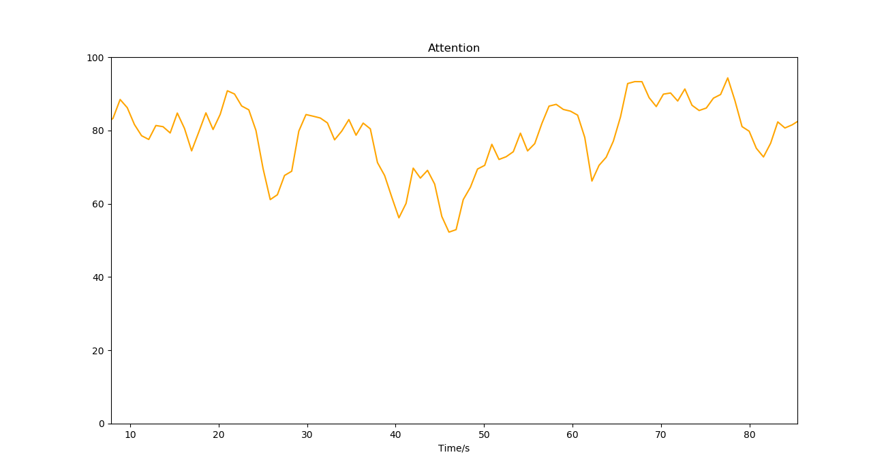
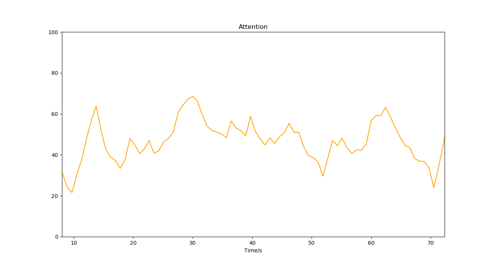

# 儿童注意力（Attention CHD）

## 名词解释
儿童的脑电波节律会随着年龄增长而发生变化[^1][^2][^3]，利用机器学习方法能够较为准确地识别不同年龄的儿童在专注状态下的脑电波[^4]。

儿童注意力监测算法采用深度学习技术，基于大量数据训练模型，针对儿童群体计算更加准确的注意力。注意力的值越高表明越专注，即大脑越活跃。

> [!NOTE]
> 提供性别、年龄等信息可以提高注意力计算的准确度。该算法不适用于成年人。

---

**参考文献**

[^1]: Orekhova, Elena & Stroganova, Tatiana & Posikera, I & Elam, M. (2006). EEG theta rhythm in infants and preschool children. Clinical neurophysiology : official journal of the International Federation of Clinical Neurophysiology. 117. 1047-62. 10.1016/j.clinph.2005.12.027. 
[^2]: Gasser, Theo & Verleger, Rolf & Bächer, Petra & Sroka, Lothar. (1988). Development of the EEG of school-age children and adolescents. I. Analysis of band power. Electroencephalography and clinical neurophysiology. 69. 91-9. 10.1016/0013-4694(88)90204-0. 
[^3]: Wo, Jianzhong & Cao, Heqi & Pan, Yu & Lin, Chongde. (2000). The Developmental Characteristics of Alpha Band in Children Aged from 6 to 12. Psychological Development & Education. 10.16187/j.cnki.issn1001-4918.2000.04.001
[^4]: Chen, He & Chen, Wenqing & Song, Yan & Sun, Li & Li, Xiaoli. (2019). EEG Characteristics of Children with Attention-Deficit/Hyperactivity Disorder. Neuroscience. 406. 10.1016/j.neuroscience.2019.03.048. 

## 最佳实践
> [!TIP]
> 通过「最佳实践」，我们会提供一些我们已经实践过的应用场景供你参考，通过这些例子你可以了解如何将我们提供的数据和你的应用场景结合。

### 儿童专注力训练
在儿童专注力训练课程中，通过儿童注意力指标可以实时反映学生的专注程度，用于及时根据学生的状态调整教学方案，或用于评价学生长期训练的效果。

儿童专注力训练课程上，正在进行专注力训练的儿童的注意力保持在较高水平。

课下，在不够专注的状态下儿童的注意力处于中等水平。

