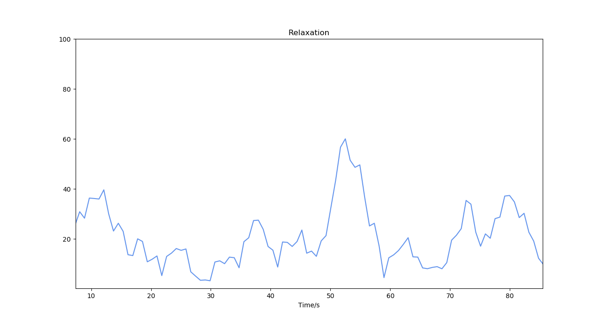

# 儿童放松度（Relaxation CHD）

## 名词解释
儿童的脑电波节律会随着年龄增长而发生变化[^1][^2][^3]，放松与焦虑状态下的儿童脑电波特征存在差异[^4]。

儿童放松度监测算法采用深度学习技术，基于大量数据训练模型，针对儿童群体计算更加准确的放松度。较高的放松度表明大脑清醒放松，而较低的放松度则表明可能处于紧张或焦虑的状态。

> [!NOTE]
> 提供性别、年龄等信息可以提高放松度计算的准确度。该算法不适用于成年人。

---

**参考文献**

[^1]: Orekhova, Elena & Stroganova, Tatiana & Posikera, I & Elam, M. (2006). EEG theta rhythm in infants and preschool children. Clinical neurophysiology : official journal of the International Federation of Clinical Neurophysiology. 117. 1047-62. 10.1016/j.clinph.2005.12.027. 
[^2]: Gasser, Theo & Verleger, Rolf & Bächer, Petra & Sroka, Lothar. (1988). Development of the EEG of school-age children and adolescents. I. Analysis of band power. Electroencephalography and clinical neurophysiology. 69. 91-9. 10.1016/0013-4694(88)90204-0. 
[^3]: Wo, Jianzhong & Cao, Heqi & Pan, Yu & Lin, Chongde. (2000). The Developmental Characteristics of Alpha Band in Children Aged from 6 to 12. Psychological Development & Education. 10.16187/j.cnki.issn1001-4918.2000.04.001
[^4]: Hannesdottir, Dagmar & Doxie King, Jacquelyn & Bell, Martha Ann & Ollendick, Thomas & Wolfe, Christy. (2010). A Longitudinal Study of Emotion Regulation and Anxiety in Middle Childhood: Associations with Frontal EEG Asymmetry in Early Childhood. Developmental psychobiology. 52. 197-204. 10.1002/dev.20425. 

## 最佳实践
> [!TIP]
> 通过「最佳实践」，我们会提供一些我们已经实践过的应用场景供你参考，通过这些例子你可以了解如何将我们提供的数据和你的应用场景结合。

### 儿童放松训练
在儿童放松训练课程中，通过儿童放松度指标可以实时反映学生的放松程度，用于及时根据学生的状态调整教学方案，或用于评价学生长期训练的效果。

儿童放松训练课程上，正在进行放松训练的儿童的放松度保持在较高水平。

紧张的状态下儿童的放松度处于较低水平。

